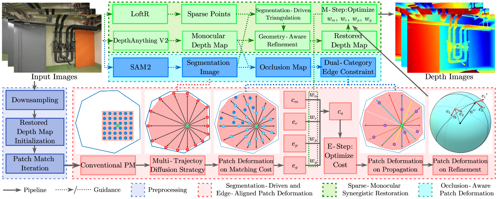

# SED-MVS

**Yuan, Z.**, Yang, Z., Cai, Y., Wu, K., Liu, M., Zhang, D., Jiang H, Li Z., Wang, Z., [**SED-MVS: Segmentation-Driven and Edge-Aligned Deformation Multi-View Stereo with Depth Restoration and Occlusion Constraint**](https://arxiv.org/pdf/2503.13721), IEEE TCSVT 2025.


## About
SED-MVS adopts panoptic segmentation via **SAM2** and multi-trajectory diffusion strategy via **LoFTR** for segmentation-driven and edge-aligned patch deformation. 
Our paper was accepted by **IEEE TCSVT 2025**!

If you find this project useful for your research, please cite:  

```
@article{yuan2025sed,
  title={SED-MVS: Segmentation-Driven and Edge-Aligned Deformation Multi-View Stereo with Depth Restoration and Occlusion Constraint},
  author={Yuan, Zhenlong and Yang, Zhidong and Cai, Yujun and Wu, Kuangxin and Liu, Mufan and Zhang, Dapeng and Jiang, Hao and Li, Zhaoxin and Wang, Zhaoqi},
  journal={IEEE Transactions on Circuits and Systems for Video Technology},
  year={2025},
  publisher={IEEE}
}

```

## Acknowledgements

This code largely benefits from the following repositories: [APD-MVS](https://github.com/whoiszzj/APD-MVS), [Semantic-SAM](https://github.com/UX-Decoder/Semantic-SAM) and [ACMMP](https://github.com/GhiXu/ACMMP.git). Thanks to their authors for opening the source of their excellent works.
